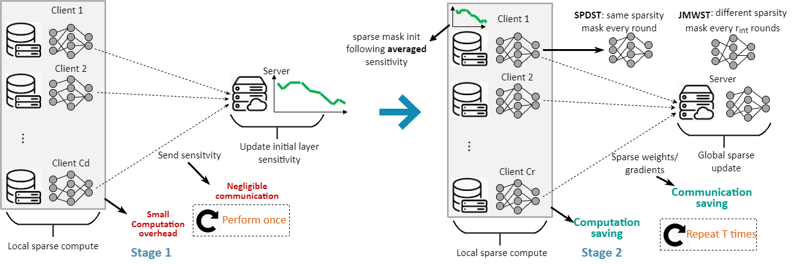

## Revisiting Sparsity Hunting in Federated Learning: Why Does Sparsity Consensus Matter?
PyTorch code for TMLR'23 paper:\
**Revisiting Sparsity Hunting in Federated Learning: Why Does Sparsity Consensus Matter?**\
**_[Sara Babakniya]_**, Souvik Kundu, Saurav Prakash, Yue Niu, Salman Avestimehr\
Transactions on Machine Learning Research, 2023\
[[pdf]]

<p align="center">

</p>

## Abstract
Edge devices can benefit remarkably from federated learning due to their distributed nature; however, their limited resource and computing power poses limitations in deployment. A possible solution to this problem is to utilize off-the-shelf sparse learning algorithms at the clients to meet their resource budget. However, such naive deployment in the clients causes significant accuracy degradation, especially for highly resource-constrained clients. In particular, our investigations reveal that the lack of consensus in the sparsity masks among the clients may potentially slow down the convergence of the global model and cause a substantial accuracy drop.
With these observations, we present *federated lottery aware sparsity hunting* (FLASH), a unified sparse learning framework for training a sparse sub-model that maintains the performance under ultra-low parameter density while yielding proportional communication benefits. Moreover, given that different clients may have different resource budgets, we present *hetero-FLASH* where clients can take different density budgets based on their device resource limitations instead of supporting only one target parameter density. Experimental analysis on diverse models and datasets shows the superiority of FLASH in closing the gap with an unpruned baseline while yielding up to ~10.1% improved accuracy with ~10.26X fewer communication, compared to existing alternatives, at similar hyperparameter settings.

## Installation

### Prerequisite
* python == 3.9
* torch == 1.13.1
* torchvision == 0.14.1

### Dataset
 * Download the datasets (CIFAR-10, CIFAR-100, TINY_IMAGENET, MNIST, FEMNIST) and set the directory in --path. 


# Run Code

#clients=100 --num_users=100
with 10 % participation ratio --frac=0.1
non-IID data distribution with $\alpha=1$ (--alpha=1)
target density (d) =0.05 --density=0.05
#federated communication round = 600(--fl_round=600)

* SPDST *
```python main.py --dataset=cifar10 --experiment_type=spdst --num_users=100 --alpha=1 --density=0.05 --fl_rounds=600 --path={PATH_TO_CIFAR10}  ```


#clients=100 --num_users=100
IID data distribution with $\alpha=1000$ (--alpha=1000)
target density (d) = 0.1 --density=0.1
#federated communication round = 600(--fl_round=600)
* JMWST *

```python main.py --dataset=cifar10 --experiment_type=jmwst --num_users=100 --alpha=1000 --density=0.1 --fl_rounds=600 --path={PATH_TO_CIFAR10}  ```

# Contact
Please contact Sara Babakniya (babakniy@usc.edu) if you have any questions.

# Citation
If you find our code or work useful, please consider citing our paper:
```
@article{
babakniya2023revisiting,
title={Revisiting Sparsity Hunting in Federated Learning: Why does Sparsity Consensus Matter?},
author={Sara Babakniya and Souvik Kundu and Saurav Prakash and Yue Niu and Salman Avestimehr},
journal={Transactions on Machine Learning Research},
issn={2835-8856},
year={2023},
url={https://openreview.net/forum?id=iHyhdpsnyi},
note={}
}
```
[Sara Babakniya]: https://sarababakn.github.io/
[pdf]: https://openreview.net/pdf?id=iHyhdpsnyi
